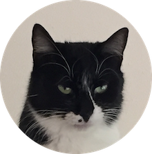
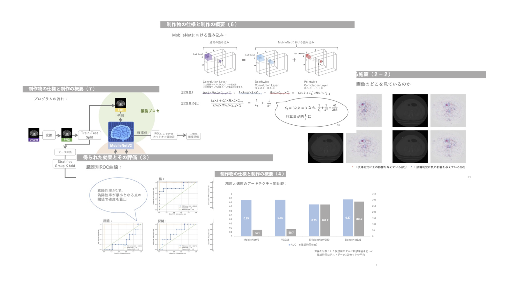
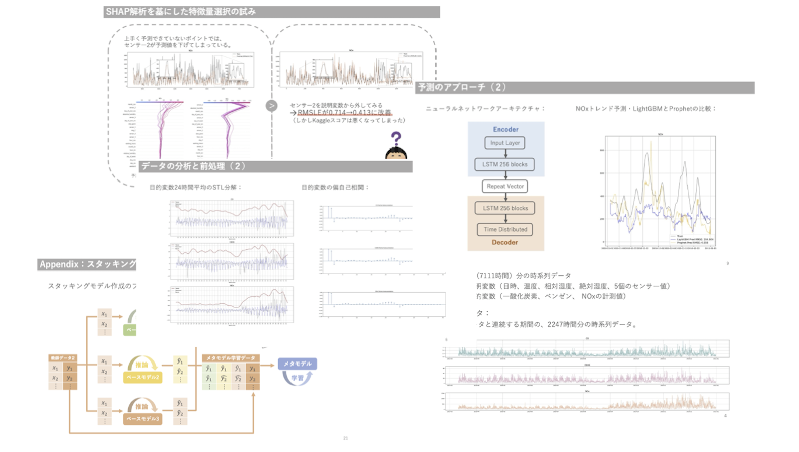
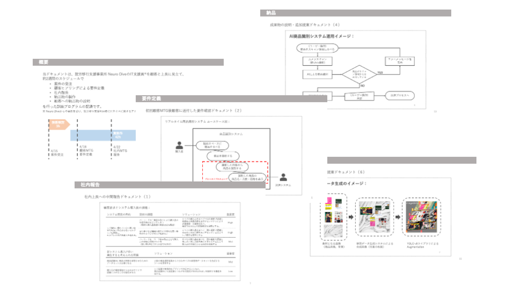

{: align="center"}

{: align="center"}
**Makoto Noda**  
(Job applicant / ML engineer wannabe)

 

## Portfolio
- **[深層学習による臓器損傷検出AIシステム](https://github.com/Makoto-Noda/RSNA2023/blob/main/(発表資料)臓器損傷検出.pdf)**
臓器損傷検出.pdf)
- **[大気汚染物質の時系列予測](https://github.com/Makoto-Noda/TPL0721/blob/main/(発表資料)大気汚染物質予測.pdf)**
大気汚染物質予測.pdf)
- **[セルフレジ用商品識別システム](https://github.com/Makoto-Noda/YOLO/blob/main/デモインターン.pdf)**

## Qualifications
- [統計検定2級](https://www.toukei-kentei.jp/exam/grade2/)
- [TOEIC Listening & Reading　スコア890点](https://www.iibc-global.org/toeic.html)
- [Googleアナリティクス認定資格](https://developers.google.com/analytics/)
- [普通自動車第一種運転免許（AT限定）](https://ja.wikipedia.org/wiki/オートマチック限定免許)
- [訪問介護員2級](https://www.e-nichii.net/kaigo/kaigosyoninsya/column/07605.html)
 

- [基本情報技術者試験（近日取得予定）](https://www.ipa.go.jp/shiken/kubun/fe.html)

## Training Programs
- [マナビDX Quest 2023年度 第1ターム ケーススタディ教育プログラムGold修了](https://dxq.manabi-dx.ipa.go.jp/)

## Skills
<table>
    <tr>
        <th></th>
        <th></th>
        <th></th>
        <th></th>
        <th></th>
        <th></th>
    </tr>
</table>

