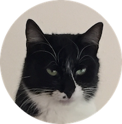

{: align="center"}

{: align="center"}
**Makoto Noda**  
(Job applicant / ML engineer wannabe)

 
 

## Portfolio
- **[深層学習による臓器損傷検出AIシステム](https://github.com/Makoto-Noda/RSNA2023/blob/main/(発表資料)臓器損傷検出.pdf)**

- **[大気汚染物質の時系列予測](https://github.com/Makoto-Noda/TPL0721/blob/main/(発表資料)大気汚染物質予測.pdf)**

## Qualifications
- 統計検定2級
- TOEIC Listening & Reading　スコア890点
- Googleアナリティクス認定資格
- 普通自動車第一種運転免許（AT限定）
- 訪問介護員2級

## Training Programs
- マナビDX Quest 2023年度 第1ターム ケーススタディ教育プログラムGold修了

## Skills
<table>
    <tr>
        <th></th>
        <th></th>
        <th></th>
        <th></th>
        <th></th>
        <th></th>
    </tr>
</table>

